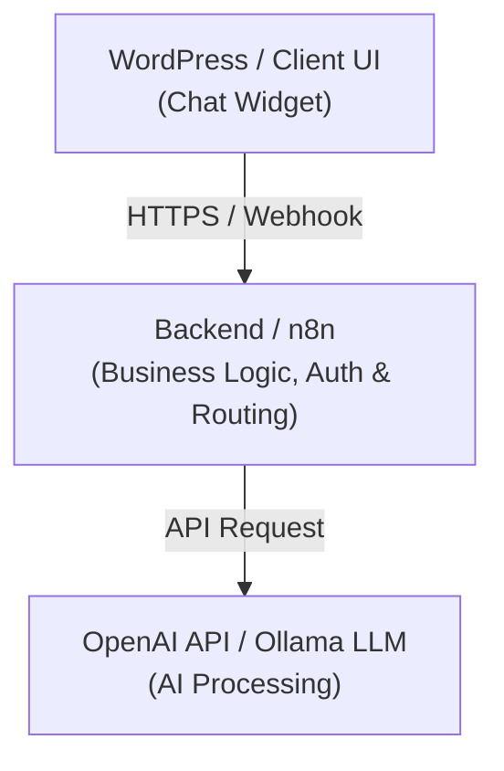

# 👋 Hola, soy Andrés Salgado
### Software Developer | Web Development | Mobile | APIs | AI Integrations

Soy desarrollador de software enfocado en la construcción e integración de soluciones web, aplicaciones móviles, APIs, automatizaciones y herramientas basadas en inteligencia artificial.

Me interesa especialmente convertir necesidades de negocio en soluciones técnicas funcionales, mantenibles y fáciles de integrar con sistemas existentes.

---

### Sobre mí
*  **Desarrollo e integración de soluciones web y mobile.**
*  **Desarrollo mobile y backend** utilizando **Kotlin** y frameworks modernos para aplicaciones multiplataforma.
*  **Ecosistema Web:** Trabajo con JavaScript, TypeScript, Node.js, React y Astro.
*  **Extensión y customización de WordPress:** Desarrollo e integración de widgets y componentes frontend/backend personalizados.
*  **Infraestructura y Despliegue:** Experiencia en hosting (Cloudways, cPanel, VPS), contenedorización con **Docker** y pipelines de **CI/CD** con **GitHub Actions**.
*  **Diseño e Integración de APIs:** Arquitecturas RESTful, comunicación orientada a eventos mediante webhooks y gestión de microservicios.
*  **Soluciones de IA Local y Cloud:** Integración de OpenAI API, orquestación de LLMs locales con **Ollama** (Qwen, Gemma) y chatbots contextuales.
*  **Automatización de Procesos:** Flujos avanzados con **n8n** y **GoHighLevel** para la automatización de flujos de trabajo e interacciones comerciales.
*  **Seguridad e Integridad:** Enfoque en buenas prácticas, separación de responsabilidades y manejo seguro de credenciales/API Keys.

---

### Tecnologías y herramientas

| Área | Tecnologías |
| :--- | :--- |
| **Lenguajes** | Kotlin, JavaScript (ES6+), TypeScript, Go, HTML5, CSS3 |
| **Web & Frontend** | React, Astro, Node.js, WordPress (Custom UI / Scripts) |
| **Mobile & Backend** | Kotlin, Node.js / Express, REST APIs, Webhooks |
| **APIs & AI** | OpenAI API, Ollama (Local LLMs), n8n, GoHighLevel, Chatbots |
| **Infraestructura & DevOps**| Docker, GitHub Actions, Linux (Mint, Ubuntu), Git Bash, Cloudways, cPanel |

---

### AI & Chatbot Development

Una de mis especialidades es la arquitectura e integración de agentes y chatbots impulsados por IA dentro de plataformas web y entornos automatizados. La arquitectura contempla una clara separación entre el frontend, la lógica de automatización y los motores de IA:



Esta arquitectura permite procesar lógica de negocio de forma privada, mantener API Keys fuera del alcance del navegador y orquestar tanto modelos en la nube como modelos locales privados.

---

###  Integración de APIs y Automatización
Desarrollo sistemas integrados orientados a eventos e interconectividad entre servicios:

* **REST APIs & Webhooks:** Consumo, producción y estructuración de respuestas JSON.
* **Orquestación de Flujos:** Automatización de soporte, venta y agendamiento utilizando **n8n** e integración con **GoHighLevel**.
* **Seguridad y Backend:** Separación de credenciales, autenticación segura y desacoplamiento de capas.

---

###  Desarrollo Mobile & Backend con Kotlin
* **Mobile Development:** Creación de MVPs multiplataforma y aplicaciones móviles enfocadas en alto rendimiento y tiempo real (ej. streaming de audio/video y comunicación bidireccional).
* **Backend:** Servicios construidos con **Kotlin** e integración con arquitecturas orientadas a eventos y APIs sólidas.

---

###  WordPress & CMS Development
Desarrollo de soluciones que extienden las capacidades nativas de WordPress mediante código personalizado:

* Desarrollo e integración de widgets dinámicos y JavaScript personalizado.
* Optimización de carga de recursos, manejo de caché y assets estáticos.
* Captive Portals y CMS para infraestructura de red municipal / masiva.
* Despliegue continuo mediante GitHub Actions directo a entornos cPanel o Cloudways.

---

###  Enfoque de desarrollo

Me interesa escribir software que no solamente funcione, sino que también sea:

*  **Mantenible:** Código organizado, limpio y estructurado para modificaciones futuras.
*  **Seguro:** Manejo responsable de credenciales, API Keys y entornos aislados (Docker).
*  **Escalable:** Arquitecturas modulares preparadas para el crecimiento en tráfico y funcionalidades.
*  **Integrable:** Capaz de conectarse de forma transparente con APIs y plataformas existentes.
*  **Orientado a resultados:** Enfocado en aportar valor real y solucionar necesidades técnicas o de negocio.

---

###  Áreas de interés

```text
Software Development
   │
   ├── Web & Mobile Development (Kotlin, React, Astro)
   │
   ├── Backend & APIs (REST, Webhooks, Kotlin, Node.js)
   │
   ├── Artificial Intelligence & LLMs (OpenAI, Ollama)
   │
   ├── Automation & Workflows (n8n, GoHighLevel)
   │
   ├── WordPress Custom Extensions
   │
   └── DevOps & CI/CD (Docker, GitHub Actions, Linux)
```

---

###  Proyectos Destacados

### 📂 Proyectos Destacados

*  **Doctor Explore AI & DUCI AI (Medical & AI Assistant Platforms):**
  * Arquitectura e integración de asistentes conversacionales con IA ("Doctor Explore AI" y "DUCI AI") para el sector médico y comercial.
  * Optimización de prompts del sistema, gestión de contexto e interfaz de widget interactivo en sitio web con migración y hosting en VPS.

*  **Vaco y Vaca (Automated Notification System):**
  * Desarrollo de plantillas y flujos de automatización para notificaciones dinámicas de reservas, confirmaciones y gestión de pedidos de clientes en tiempo real.

*  **FCPC - Fondo Complementario Previsional Cerrado:**
  * Implementación y desarrollo de soluciones digitales y gestión de infraestructura web/plataforma para el Fondo Complementario Previsional de servidores públicos.

*  **Start Companies & Multi-Business Automations:**
  * Diseño e implementación de soluciones tecnológicas personalizadas para emprendimientos y startups (*Start Companies*).
  * Automatización de flujos de trabajo en **GoHighLevel** y **n8n**, conectando CRM, agentes de soporte e integración de canales de comunicación.

*  **AI Chatbot & Local LLM Integration:**
  * Integración de agentes e interfaz de chat flotante en WordPress y plataformas web con backend seguro.
  * Despliegue de **Ollama** con modelos locales (**Qwen, Gemma**) en contenedores **Docker** orquestados mediante **n8n**.
  * Optimización de buffers, respuestas en streaming y configuración de proxies (Nginx/Cloudways) para comunicación en tiempo real.

*  **E-Commerce & Agent AI for Automotive/E-Commerce:**
  * Propuesta técnica y comercial para la integración de agentes de venta conversacionales y gestión automatizada de inventario en plataformas web.
  * Filtrado inteligente de compatibilidad de productos y carga/actualización automatizada de catálogos mediante IA.

*  **Captive Portal CMS & Public Network Infrastructure (Quito Municipal Wi-Fi):**
  * Arquitectura e implementación de un Captive Portal y CMS para gestionar el acceso a internet en redes públicas masivas (~2,500 puntos Wi-Fi).
  * Flujos de autenticación, reproducción obligatoria de video publicitario y paneles de control centralizados para monitoreo de usuarios.

*  **Mobile Multiplatform MVP (Real-Time Audio):**
  * Prototipado y arquitectura de aplicación móvil interactiva centrada en transmisión de audio en tiempo real y baja latencia.
  * Desarrollo de servicios backend con **Kotlin** e integración de APIs para gestión de sesiones y comunicación bidireccional.

*  **Automated CI/CD Deployment Pipelines:**
  * Implementación de automatizaciones con **GitHub Actions** para compilar y desplegar proyectos **React** y **Astro** directamente en servidores de producción (cPanel / Cloudways via SSH).
---

###  Actualmente
Actualmente estoy profundizando en:

*  Arquitectura avanzada mobile y servicios backend con **Kotlin**.
*  Privacidad y despliegue local de modelos de IA con **Ollama** y **Docker**.
*  Automatización avanzada con **n8n** para pipelines de datos y ventas.
*  Optimización de entrega continua mediante **GitHub Actions**.

---

###  Contacto

Si estás interesado en colaborar en un proyecto relacionado con desarrollo web/móvil, APIs, automatización o inteligencia artificial, puedes contactarme.

* **Email:** [andressalgado41@gmail.com]

 *"Build. Integrate. Automate. Improve."*
